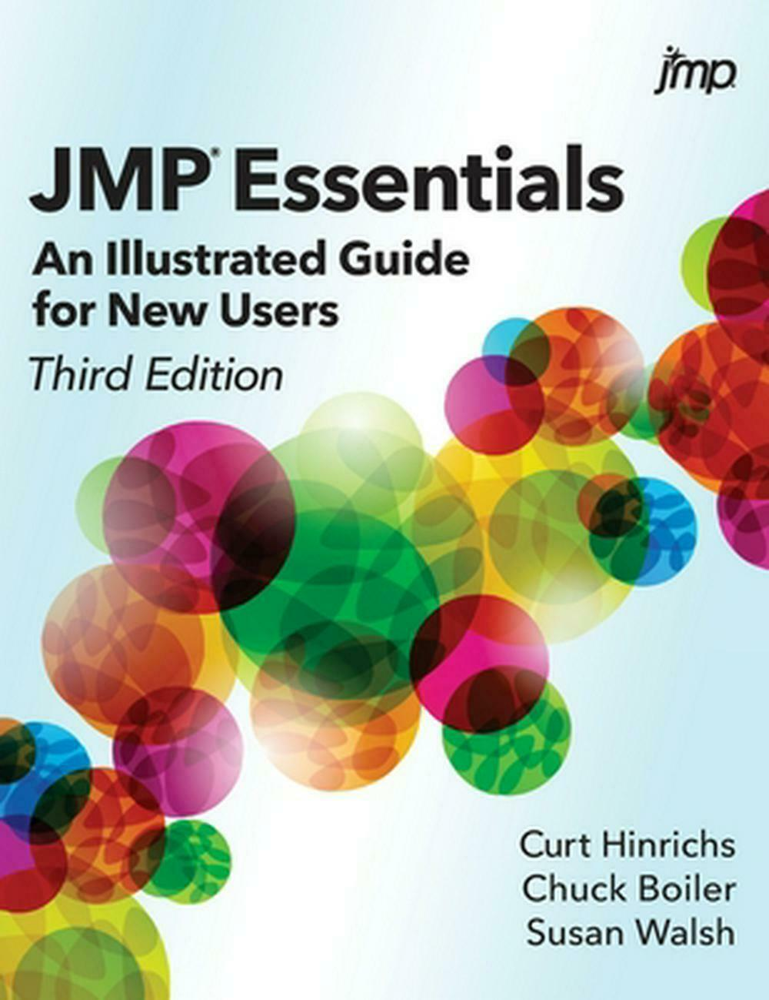

# JMPⓇ Essentials: An Illustrated Guide for New Users, Third Edition

by Curt Hinrichs, Chuck Boiler, and Susan Walsh

This repository contains the example data for the book *JMPⓇ Essentials: An Illustrated Guide for New Users, Third Edition*. All data sets are in the form of .jmp files.

## Description
<b>
Grasp the essentials of JMP to generate rapid results.</b>

<i>JMPⓇ Essentials: An Illustrated Guide for New Users, Third Edition,</i> is designed for new or novice JMP users who need to generate meaningful analysis quickly. The book focuses on the most commonly used platforms and typical workflow of the user, from data importing, exploring, and visualizing to modeling and sharing results with others. Throughout the book, the authors emphasize results over theory, providing just the essential steps with corresponding screenshots. In most cases, each section completes a JMP task, which maximizes the book’s utility as a reference.

This edition has new instructions and screenshots reflecting the features added to the latest release of JMP software, including updated sections on JMP Dashboard Builder, Query Builder, the Fit Model platform, JMP Public and JMP Live, and a more detailed look at the JMP website. Each chapter contains a family of features that are carefully crafted to first introduce you to basic features and then move on to more advanced topics. <i>JMPⓇ Essentials: An Illustrated Guide for New Users, Third Edition,</i> is the quickest and most accessible reference book available.

## Details

*Epub* ISBN: 978-1-64295-391-6 
*Kindle* ISBN: 978-1-64295-392-3 
*PDF* ISBN: 978-1-64295-390-9 
*Paperback* ISBN: 978-1-64295-389-3 
*Hardback* ISBN: 978-1-64295-650-4

<a href="http://www.sas.com/store/prodBK_73047_en.html"><i>Book Excerpt and Table of Contents</i></a>

*About the Authors*: <a href="https://www.sas.com/sas/books/authors/curt-hinrichs.html">Curt Hinrichs</a>, <a href="https://www.sas.com/sas/books/authors/chuck-boiler.html">Chuck Boiler</a>, and <a href="http://support.sas.com/walsh">Susan Walsh</a>

## License

This project is licensed under the [Apache 2.0 License](./LICENSE).
